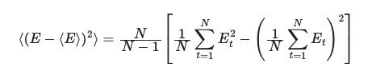

# Calculating the standard deviation

In this exercise we are going to remind ourselves how to compute the variance.  We will also see that computing the error is not simply a matter of computing the variance.

Recall that the sample variance is given by:



For this exercise I want you to calculate this quantity for:

* The first 100 energies in this file
* The second 100 energies in this file
* The third 100 energies in the file 
* and so on. 

The values for these 10 variances should be stored in the array called `variances`, which I have already created for you and which you will notice is plotted in the final few lines of Python in the panel on the left.

In addition to computing these 10 values for the block variance I would also like you to compute the variance using all the data in the trajectory.  The value of this variance should be stored in a variable called `total_var`.  

To complete the exercise you will need to plot a graph with two data series.  You will use the first data series to show the variances from each of the blocks.  The x-coordinates of the 10 points of this line should thus be the integers
from 1 to 10.  The y-coordinates will then be the values of the 10 block variances that you have obtained.  The point with x-coordinate 1 should be the block variance from the first 100 energies, the point with x-coordinate 2 should be the block
variance from the second 100 energies and so on.

The thing you will plot is a line indicating the total variance for all the data.  You can plot this with a command like the following:

```python
plt.plot( [1,10], [total_var,total_var], 'r-' )
```

This command ensures that a red horizontal line is drawn to indicate the value of the total variance.  You should find that black dots illustrating the block variances should all be reasonably close to the red line.  This makes sense - both sets of calculations 
that you are performing here are estimating the same quantity.  The only difference is that when you compute the variances from each block of data you have fewer data points.

The x-axis label for your graph should be "Index" and the y-axis label should be "Variance / energy^2"  
